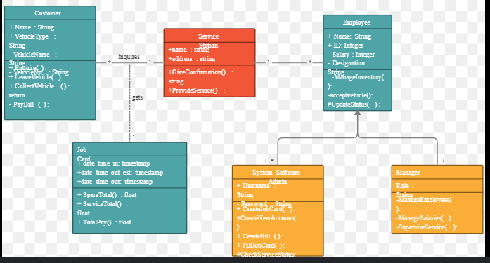
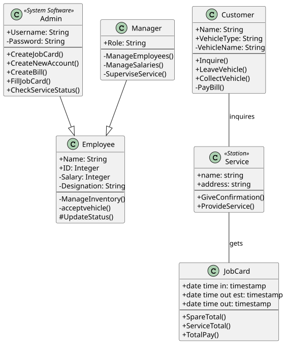
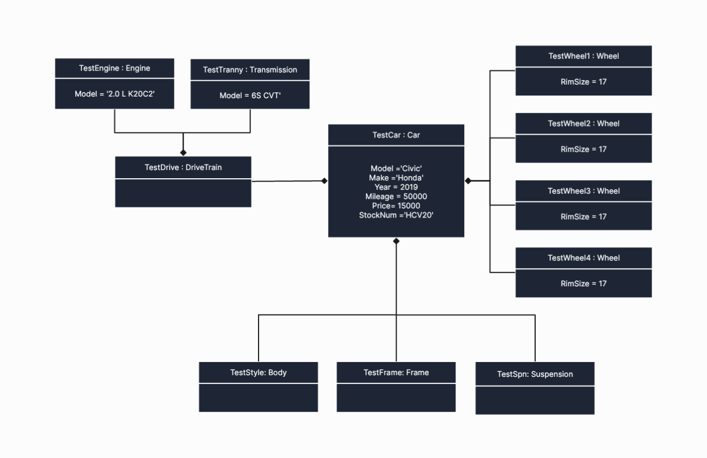
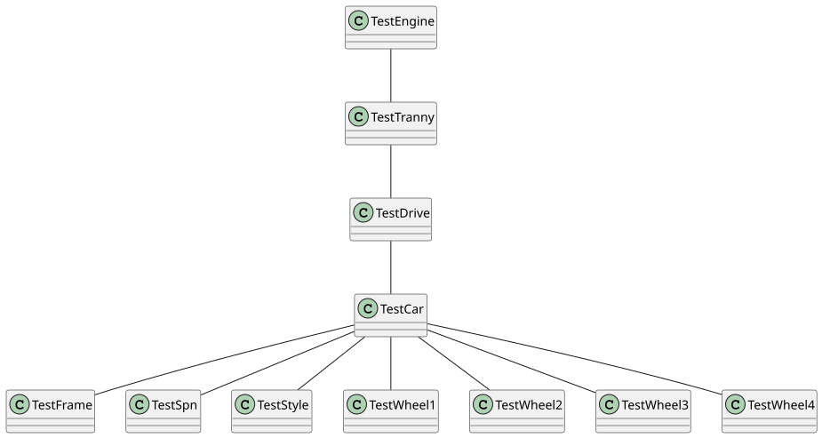

# uml-regenerator

Turn a picture of a UML class diagram into editable PlantUML (`.puml`) source — a single command instead of redrawing it by hand.

Point it at a PNG, JPG, or screenshot of a class diagram and it produces clean, deterministic `.puml` text you can open and edit, plus a `review.md` sidecar listing the relationships it's least sure about.

## See it in action

Two real, uncurated diagrams — not cherry-picked test fixtures.

### A standard class diagram

| Source | Regenerated |
|---|---|
|  |  |

*Source: [Automobile Service Station class diagram, Creately](https://creately.com/diagram/example/hezde9vg1/automobile-service-station-class-diagram)*

All 6 classes, attributes and methods essentially complete, both inheritance relationships correctly identified — [full `.puml`](docs/examples/class-diagram-standard/output.puml).

### A diagram using a notation the tool doesn't target

| Source | Regenerated |
|---|---|
|  |  |

*Source: [BoardMix community diagram](https://boardmix.com/community/6b87XkjpLYmSmwKpDCvBZg/)*

This one labels each box as an *instance* of a class (`TestDrive : DriveTrain`) rather than the class itself — a different UML diagram type. All 11 class names came through, but every type was silently dropped, every attribute was lost, and every relationship's kind came back wrong — [full `.puml`](docs/examples/object-instance-notation/output.puml). Nothing in the output warns that this happened; see [What the tool cannot do](#what-the-tool-cannot-do) below.

## What the tool can do

- Reads a PNG/JPG/screenshot of a **UML class diagram** and extracts classes, interfaces, abstract classes, stereotypes, attributes, methods, and visibility markers (`+`/`-`/`#`/`~`).
- Identifies relationships and their kind — inheritance, realization, composition, aggregation, association, dependency — along with multiplicities and edge labels where shown.
- Outputs clean, human-editable `.puml` text as the actual deliverable, not a picture. Optionally renders it to SVG, PNG, or PDF as a convenience.
- Caches every response locally, so re-running with `--reuse-cache` gets byte-identical output back instantly and for free. **Off by default**, deliberately: an ordinary repeat run pays for a fresh answer rather than silently replaying an old one, even if that old one was a fluke.
- Flags relationships it's least confident about in a `review.md` sidecar, each with the exact `.puml` line to check (see the caveat below on how much to trust this).
- Works as both a command-line tool and an importable Python library.
- Costs nothing to try — the default model is free; a one-line override switches to a paid tier that costs a fraction of a cent per diagram if you want more consistent results.

## What the tool cannot do

- **Cannot read hand-drawn or whiteboard diagrams.** Only rendered or photographed *digital* diagrams are supported.
- **Only understands class diagrams** — not sequence, state, activity, component, or use-case diagrams.
- **Does not recognize UML *object*/instance diagrams as a different notation, and won't tell you it's confused.** Given a diagram that labels boxes as instances (`someObject : SomeClass`) rather than plain classes, it silently reads the instance name as if it were the class name, drops the type, and loses attributes and relationship kinds across the board — see the second example above. It fails quietly, not loudly.
- **Cannot reliably tell you which parts of its own output are wrong.** `review.md` is meant to flag uncertain relationships, but the underlying confidence signal doesn't track actual correctness in the current version — don't rely on an unflagged relationship being a correct one.
- **Processes one image at a time.** No folder or batch mode yet.
- **Sends every image to a cloud AI provider (OpenRouter).** There's no offline or local mode, so this isn't appropriate for confidential or proprietary diagrams.
- **Its optional self-check pass (`--verify`) doesn't actually help.** It's measured to make output *less* accurate, not more, so it's off by default.
- **Only generates `.puml` — it doesn't read or edit existing PlantUML files.**
- **Command-line and library only.** No GUI, no web interface.
- **Best accuracy is only claimed up to about 15 classes and 25 relationships per diagram.** Beyond that it still runs and warns you, but treat the result as rougher.

## Installation

### Prerequisites

The renderer shells out to `plantuml.jar`, which needs a JRE and Graphviz (`dot`) on `PATH`.

**Windows** (verified on Windows 10, via `winget`):

```powershell
winget install --id EclipseAdoptium.Temurin.21.JRE -e
winget install --id Graphviz.Graphviz -e
```

The Graphviz installer does not currently add itself to `PATH`; add it manually if `dot -V` fails after install:

```powershell
[System.Environment]::SetEnvironmentVariable(
  "Path",
  [System.Environment]::GetEnvironmentVariable("Path","User") + ";C:\Program Files\Graphviz\bin",
  "User"
)
```

Then fetch `plantuml.jar` (no installer; it's a standalone jar):

```bash
mkdir -p tools
curl -sL -o tools/plantuml.jar https://github.com/plantuml/plantuml/releases/latest/download/plantuml.jar
```

Verify the toolchain:

```bash
java -jar tools/plantuml.jar -testdot
```

Expected output: `Installation seems OK. File generation OK`.

### Project setup

To develop on this repo, or run everything from within a clone:

```bash
uv python pin 3.12
uv sync
```

Commands below assume this path — every `uml-regen ...` is `uv run uml-regen ...` from inside the clone.

### Installing as a standalone command

If you just want the `uml-regen` command available globally, without keeping a clone around:

```bash
uv tool install "git+https://github.com/modular-v8/image-to-puml.git"
```

(Once a tagged release exists, pin to it with `@v0.1.0` appended to the URL — untagged installs track `main`.)

This installs a real `uml-regen` executable — no `uv run` prefix needed. One thing changes: `plantuml.jar`'s default location is resolved relative to your *current directory*, which only makes sense inside a clone. Running as a standalone tool from an arbitrary directory, point `UMLREGEN_PLANTUML_JAR` at wherever you downloaded it instead:

```bash
export UMLREGEN_PLANTUML_JAR=/absolute/path/to/plantuml.jar
uml-regen doctor
```

### API key

Get a key from [openrouter.ai/keys](https://openrouter.ai/keys) (the free tier needs no payment method). The CLI reads `OPENROUTER_API_KEY` from the environment; a `.env` file in the project root is also picked up automatically. **Never commit `.env`.**

```bash
echo 'OPENROUTER_API_KEY=your-key-here' > .env
```

### Verify the install

```bash
uv run uml-regen doctor
```

Reports the JRE, Graphviz, `plantuml.jar`, and API key presence (never the key's value), plus the resolved cache location. Exits non-zero and names the specific missing piece if anything's wrong.

## Usage

```bash
uv run uml-regen run "path/to/diagram.png"
```

Writes everything to `output/diagram/` (named from the input's filename, next to wherever you run the command): `diagram.puml` (the deliverable), `diagram.review.md`, `diagram.ir.json` (the raw extracted structure, if you want it), and `run.json` (which model, cost, duration, warnings). Nothing is rendered to an image unless you ask for it:

```bash
uv run uml-regen run "path/to/diagram.png" --render svg
```

That adds `output/diagram/diagram.svg` alongside the rest. `output/` is disposable and gitignored — safe to delete anytime; re-running regenerates it.

Common flags (`uv run uml-regen run --help` for the full list):

| Flag | Effect |
|---|---|
| `-o / --output PATH` | Write the `.puml` here instead, overriding the `output/` convention entirely — sidecar files land next to it. |
| `--render svg\|png\|pdf` | Also render the `.puml` to this format. Omit for `.puml` only. |
| `--model MODEL_ID` | Override the configured vision model (see [Model selection](#model-selection) below). |
| `--reuse-cache` | Serve a cached response instead of a fresh call, if one exists for this exact request. **Off by default** — every explicit run pays for a fresh answer unless you opt in. |
| `--verify / --no-verify` | Optional self-check pass. **Off by default** — see [What the tool cannot do](#what-the-tool-cannot-do). |
| `-v`, `-vv` | Increase output detail. |

Two other commands exist for reproducing this project's own evaluation runs rather than everyday use — `uv run uml-regen corpus` and `uv run uml-regen eval`; `--help` on each documents their flags.

## Model selection

The default model is free (`google/gemma-4-26b-a4b-it:free`) — a stranger's first run costs $0. It's fast and generally reliable, but occasionally returns a malformed or incomplete response; a retry mechanism handles that automatically. If you hit a rate limit (the free tier can get congested under load), override to the paid tier of the same model:

```bash
uv run uml-regen run "path/to/diagram.png" --model google/gemma-4-26b-a4b-it
```

This costs a fraction of a cent per diagram and has no rate limit. It's also what this project's own accuracy figures below were measured on, since the free tier's reliability was found to vary too much run-to-run to trust for measurement. Any OpenRouter vision-capable model ID can be passed to `--model`.

## Accuracy

Measured on two sets: a synthetic corpus of 9 hand-authored diagrams, and a hand-labelled holdout of 8 real-world diagrams the tool was never tuned against.

| Metric | Corpus | Holdout |
|---|---|---|
| Diagrams scored | 9/9 | 8/8 |
| Class recall | 100.0% | 95.0% |
| Member (attribute/method) F1 | 66.7% | 98.9% |
| Relationship F1 | 81.2% | 72.7% |
| Relationship kind accuracy, given the right two classes | 91.7% | 76.0% |
| Typical cost per diagram (paid tier) | under $0.001 | under $0.001 |

Read the corpus figures as an easy-mode ceiling (synthetic, plain notation) and the holdout figures as the more realistic picture. Two specific holdout diagrams account for most of the gap between the two sets on relationship metrics — one real model error, and one case where the model got the structure right but misread a single letter in a class name, which a strict scorer then counted as a bigger miss than it actually was.

---

See [`FUTURE.md`](FUTURE.md) for ideas deliberately left for later, and [`RETROSPECTIVE.md`](RETROSPECTIVE.md) for what building this actually taught.
